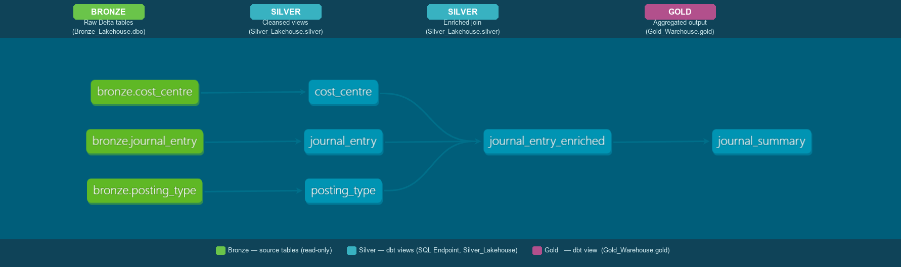

# dbt + Microsoft Fabric SQL Endpoint — Medallion Lakehouse PoC

A working proof-of-concept showing how **dbt Core** deploys a full
Bronze → Silver → Gold medallion view stack directly to the **SQL Endpoint**
of a Microsoft Fabric Lakehouse, without any manual dependency wiring.



---

## Why this matters

dbt Core connects to the SQL Endpoint of a Fabric Lakehouse via the
`dbt-fabric` adapter and deploys your SQL models as views — with automatic
dependency resolution, built-in lineage, and environment parameterisation all
included.

| Capability | How dbt handles it |
|---|---|
| Dependency order | Inferred automatically from `ref()` — no manual ordering |
| Multi-environment targeting | `env_var()` + `--target` flag |
| Lineage visibility | Built-in DAG + `dbt docs` — no extra tooling |
| Parameterised names | Jinja vars / macros |
| Cross-database views | Native via `source()` declarations |

---

## Architecture — Medallion Lakehouse

```
┌──────────────────────────────────────────────────────────────────────┐
│  Microsoft Fabric Workspace                                          │
│                                                                      │
│  ┌─────────────────┐    ┌─────────────────┐    ┌─────────────────┐  │
│  │ Bronze_Lakehouse│    │Silver_Lakehouse │    │  Gold_Warehouse │  │
│  │                 │    │                 │    │                 │  │
│  │  Delta tables   │───▶│  SQL Endpoint   │───▶│  SQL Endpoint   │  │
│  │  (dbo schema)   │    │  (silver schema)│    │  (gold schema)  │  │
│  │                 │    │                 │    │                 │  │
│  │ posting_type    │    │ posting_type    │    │ journal_summary │  │
│  │ cost_centre     │    │ cost_centre     │    │                 │  │
│  │ journal_entry   │    │ journal_entry   │    │                 │  │
│  │                 │    │ journal_entry_  │    │                 │  │
│  │  ← PySpark      │    │   enriched      │    │                 │  │
│  │    notebook      │    │                 │    │                 │  │
│  └─────────────────┘    └─────────────────┘    └─────────────────┘  │
│                                  ▲                      ▲            │
│                           dbt source()            dbt ref()          │
│                           reads Bronze           reads Silver        │
└──────────────────────────────────────────────────────────────────────┘
```

### Layer responsibilities

**Bronze — Lakehouse (`Bronze_Lakehouse.dbo`)**
Raw Delta tables. No transformation. Loaded by PySpark notebook
(`scripts/create_bronze_tables.py`). dbt treats this layer as read-only via
`source()` declarations.

**Silver — Lakehouse SQL Endpoint (`Silver_Lakehouse.silver`)**
dbt views that apply light cleansing and business rules:
- Filter inactive reference records (`is_active = 0`)
- Exclude journal entries with null amounts
- Join fact and dimension views into a single enriched model
  (`journal_entry_enriched`) that serves as the Gold input

**Gold — Data Warehouse (`Gold_Warehouse.gold`)**
dbt views that aggregate Silver into consumption-ready outputs for Power BI,
Excel, or ad-hoc SQL queries. Lives on a Fabric **Data Warehouse** SQL
Endpoint (not a Lakehouse), demonstrating cross-item lineage within the same
workspace.

---

## Dependency graph

dbt infers this order automatically from `ref()` and `source()` — no manual
script ordering required.

```
Bronze_Lakehouse.dbo
├── posting_type   ──────────────────────────────────────┐
├── cost_centre    ─────────────────────────────────────┐│
└── journal_entry  ──────────────────────────────────┐ ││
                                                      ▼ ▼▼
                                           Silver: journal_entry_enriched
                                                          │
                                                          ▼
                                              Gold: journal_summary
```

---

## Prerequisites

Three things must exist in your Fabric workspace **before** running `dbt run`.

### 1. Bronze_Lakehouse

A Fabric Lakehouse named `Bronze_Lakehouse` (or set `DBT_BRONZE_DATABASE` to
your actual name).

The three base Delta tables must be created in the `dbo` schema by running
the PySpark notebook script:

```
scripts/create_bronze_tables.py
```

**How to run it in Fabric:**
1. Open `Bronze_Lakehouse` in the Fabric portal.
2. Create a new Notebook and attach it to `Bronze_Lakehouse`.
3. Copy each `# ── Cell N` block into a separate notebook cell.
4. Run the cells top-to-bottom (Cell 1 → Cell 5).
5. Cell 5 prints a verification table — confirm all three tables appear.

> The script creates `dbo.posting_type`, `dbo.cost_centre`, and
> `dbo.journal_entry` as Delta tables. Without these, the `source()`
> references in dbt will resolve to missing objects and the run will fail.

### 2. Silver_Lakehouse

A Fabric Lakehouse named `Silver_Lakehouse` (or set `DBT_SILVER_DATABASE`).

The `silver` schema must exist on its SQL Endpoint. dbt will create the views
inside it, but the schema itself needs to be present first.

Create it once via the SQL Endpoint query editor:

```sql
CREATE SCHEMA silver;
```

### 3. Gold_Warehouse

A Fabric Data Warehouse named `Gold_Warehouse` (or set `DBT_GOLD_DATABASE`).

The `gold` schema must exist. Create it once:

```sql
CREATE SCHEMA gold;
```

---

## Installation

```bash
pip install dbt-core dbt-fabric
```

Requires **ODBC Driver 18 for SQL Server** — download from
[Microsoft](https://learn.microsoft.com/en-us/sql/connect/odbc/download-odbc-driver-for-sql-server).

Authenticate with your Fabric identity:

```bash
az login
```

---

## Configuration

### profiles.yml

Copy `profiles.yml` to `~/.dbt/profiles.yml` (or keep it project-local) and
replace the `host` placeholder with your SQL Endpoint hostname.

Find it in the Fabric portal: **Lakehouse → SQL Endpoint → Settings →
SQL connection string** — copy the server value.

```yaml
dev:
  host: <your-workspace>.datawarehouse.fabric.microsoft.com
```

Authentication uses `CLI` mode, which picks up your active `az login` token.
No secrets are stored in the profile.

### Environment variables (optional)

Override any database or schema name without editing files:

| Variable | Default | Purpose |
|---|---|---|
| `DBT_BRONZE_DATABASE` | `Bronze_Lakehouse` | Bronze Lakehouse name |
| `DBT_BRONZE_SCHEMA` | `dbo` | Schema of Bronze Delta tables |
| `DBT_SILVER_DATABASE` | `Silver_Lakehouse` | Silver Lakehouse name |
| `DBT_SILVER_SCHEMA` | `silver` | Schema for Silver views |
| `DBT_GOLD_DATABASE` | `Gold_Warehouse` | Gold Warehouse name |
| `DBT_GOLD_SCHEMA` | `gold` | Schema for Gold views |

---

## Running dbt

```bash
# Verify connection and sources
dbt debug
dbt source freshness   # optional

# Deploy all views
dbt run

# Point at a different workspace
export DBT_SILVER_DATABASE=Silver_Dev
export DBT_GOLD_DATABASE=Gold_Dev
dbt run --target dev

# Switch to prod profile
dbt run --target prod
```

---

## Project structure

```
dbt-sql-endpoint-fabric/
├── dbt_project.yml              # Project config, env var bindings
├── profiles.yml                 # Connection profile template
├── macros/
│   └── generate_schema_name.sql # Prevents dbt from prefixing schema names
├── models/
│   └── silver/
│       ├── sources.yml          # Bronze source declarations
│       ├── posting_type.sql     # Silver view — reference data
│       ├── cost_centre.sql      # Silver view — dimension
│       ├── journal_entry.sql    # Silver view — fact (Layer 1)
│       └── journal_entry_enriched.sql  # Silver view — enriched join (Layer 2)
│   └── gold/
│       └── journal_summary.sql  # Gold view — aggregated output
└── scripts/
    └── create_bronze_tables.py  # PySpark notebook — run in Fabric first
```

---

## What this demonstrates

**Automatic dependency resolution**
`ref('journal_entry')` inside `journal_entry_enriched.sql` tells dbt to
materialise `journal_entry` first. The entire DAG resolves automatically,
even across Silver Layer 1 → Silver Layer 2 → Gold — with no manual ordering.

**Parameterisation that scales**
Database names, schema names, and table identifiers are all driven by
`env_var()` in `dbt_project.yml`. Swapping dev to prod is one flag — no
file edits.

**Lineage out of the box**
Run `dbt docs generate && dbt docs serve` to see a full dependency DAG and
column-level lineage across Bronze → Silver → Gold, all from `source()` and
`ref()` declarations.

**Cross-item lineage within a single Fabric workspace**
The same project writes views into a Lakehouse (`Silver_Lakehouse`) and a
Warehouse (`Gold_Warehouse`). dbt tracks the full chain without any extra
configuration.

---

## Tested with

- dbt Core 1.8
- dbt-fabric (Microsoft's adapter for Fabric SQL Endpoint / Synapse)
- Microsoft Fabric (trial capacity)
- ODBC Driver 18 for SQL Server

---

## License

MIT
